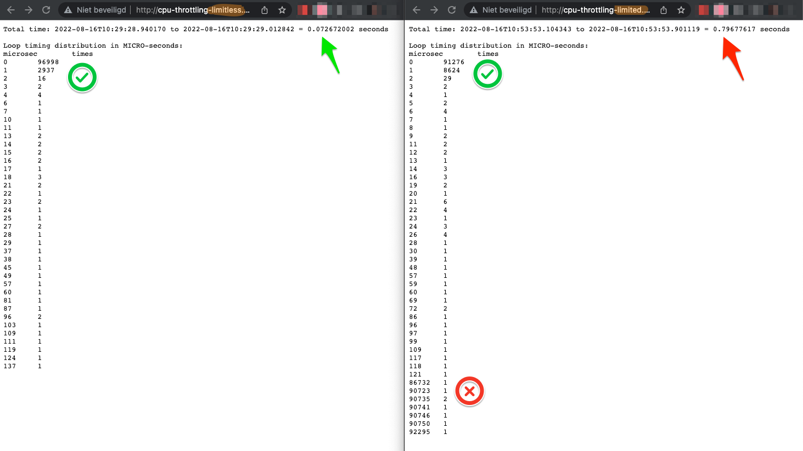

# k8s-cpu-throttling-demo

This demo will show how response times will become significantly longer when you only add a cpu-limit, even when there is hardly any load on the nodes.

## Background story

We at de Volksbank have been adding memory and cpu requests and limits to as much pods as we could, to ensure viability of all resources.

This however turns out to create a problem. CPU limits are not intuitively understandable ceilings to which a pod may grow. CPU limits do something else than what you would expect and they will seriously cripple the performance of your pods if used unwisely. Best practice is to never use cpu limits.

## Understanding CPU limits

When you add a CPU limit of 200ms to a pod, that means that it will get throttled. These 200ms are one-fifth of a second. Remember that value.

Linux, the underlying system of a kubernetes cluster, usually measures cpu-windows in spans of 100ms. When a container gets throttled, it will get a relative part of those 100ms. In our case, the spec-limit of 200ms is one-fifth which translates into 20ms per window of 100ms.

So due to the limit of one-fifth in your cpu-limit spec, your pod will receive only bursts of 20ms per 100ms. This will increase your processing and thus response time to five times the value it had without the limit.

## cpu-throttling-demo

This demo will set up two identical ingresses, two identical services and two identical deployments with identical images, except for the cpu-limits. In the limited deployment, the cpu-limit is set to 100ms. That translates into bursts of 10ms per 100ms.

The setup is apache with a simple cgi python script that calculates pi in X iterations. The number of iterations can be changed with the 'counter' parameter in the url.

The time each iteration took is stored in an array. After that has been done, the differences are sorted, counted and outputted to the browser.

These differences will show gradual differences in the limitless version of the setup. However, in the limited version you will notice there are entries with 90,000+ microseconds difference between two iterations. These are the iterations at which cpu-throttling has happened.

As you will experience the limited version will increase the response time by ten-fold.

## Example

On the left you can see the limitless pod acting nicely and performing fast.

On the right you can see the limited pod being throttled. The large timing differences per iteration noticed and shown the bottom indicate the request was cpu-throttled. As you can see, the response time is over ten times as high as the limitless request.

## URLs
After deployment of this setup, you can see the results here:

- http://cpu-throttling-limited.np18.aws.local/
- http://cpu-throttling-limitless.np18.aws.local/

## See also

- https://home.robusta.dev/blog/stop-using-cpu-limits/
- https://komodor.com/learn/kubernetes-cpu-limits-throttling/
- https://medium.com/omio-engineering/cpu-limits-and-aggressive-throttling-in-kubernetes-c5b20bd8a718
- https://www.youtube.com/watch?v=4CT0cI62YHk#t=21m33s

